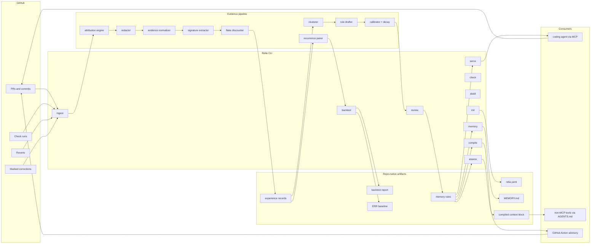
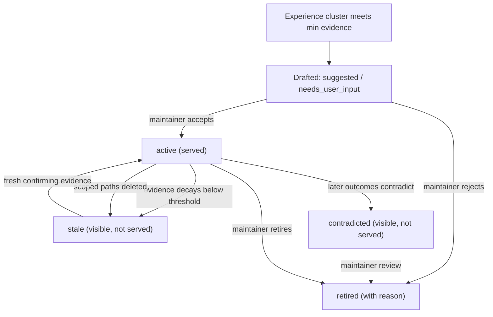
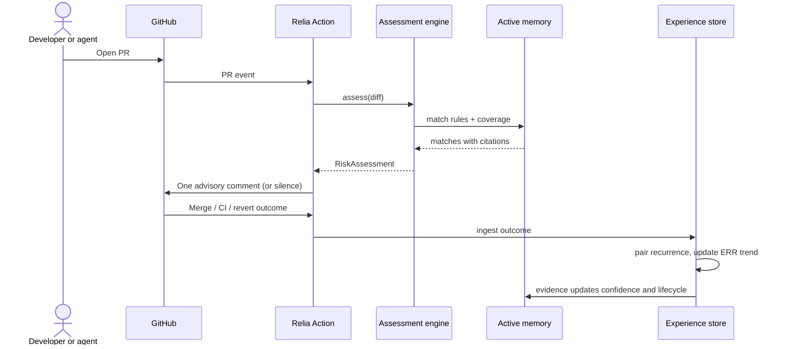

# Relia OSS MVP - Product Requirements And Build Spec

| Field | Value |
|-------|-------|
| Version | 1.1 |
| Status | Ready for MVP execution |
| Owner | Product and Engineering |
| Last Updated | 2026-06-11 |
| Primary Audience | Engineers building Relia OSS, plus technical founders reviewing scope |
| MVP Scope | Full MVP: ingest/attribute/backtest, distill/calibrate/review, and serve/advise |

---

## Purpose

This document is the developer-ready MVP PRD for Relia OSS.

Relia is outcome memory for coding agents: it records what agent-authored changes actually did (CI passed, CI failed, PR reverted, reviewer corrected), distills those outcomes into calibrated, provenance-backed memory rules, and serves that memory back to any coding agent so the same mistake is not repeated.

It narrows the larger Relia strategy into the first executable product:

- verified-outcome capture from GitHub, attribution of agent-authored changes, and a recurrence backtest over repo history
- distillation of experiences into calibrated rules with confidence, decay, and mandatory provenance, behind a human review gate
- serving memory to agents via MCP and a compiled context block, plus an advisory PR comment that cites prior outcomes

This document intentionally excludes post-MVP capabilities such as hosted multi-tenant memory, cross-repo organization memory, GitLab/Bitbucket intake, production incident ingestion, self-judged agent reflections, runtime blocking, and fine-tuned adapters. The PR advisory loop — a GitHub Action wrapping `assess` with a single evidence-citing comment — is required for the MVP public release because the advisory loop is the retention engine.

The goal is to give engineering a clear build contract: what to implement, what to defer, what artifacts must exist, what commands must do, and what "done" means.

### Relationship to the master strategy

The master strategy (June 2026 positioning analysis) is the vision source of truth. Its load-bearing conclusions are restated here because this document must be self-contained:

- context self-editing is commodity (system-prompt learning, ACE playbooks, vendor-native memory); Relia's defensible ground is verified outcomes, calibrated governance, a risk-gated decision signal, and org-level memory with receipts
- the category metric is **error recurrence rate (ERR)**: the share of agent-attributed failures that repeat an earlier, already-observed failure
- the wedge is coding agents on GitHub because outcome labels there are free, instant, and unambiguous
- the backtest delivers the aha before any adoption or behavior change

Where this MVP defers something the strategy wants (for example cross-repo memory or non-GitHub forges), the deferral is intentional and flagged inline. Strategy questions are resolved in the master strategy; build questions are resolved here.

For zero ambiguity:

- the asset under management is the team's outcome history
- the durable artifact is a reviewed, version-controlled memory rule with provenance
- memory writes originate from verified outcome events, never from self-judged agent reflections
- the backtest is the first value experience; it must not require any workflow change
- serving is advisory; Relia must never block a merge in the MVP
- every rule must cite at least one provenance link; an uncited rule must never render
- headline metrics must be conservative; uncertain matches are excluded from the headline ERR
- the compiled AGENTS.md/CLAUDE.md block is a derivative; the MCP server is the primary serve surface
- Relia must not claim a rule is "learned" when the evidence only shows one ambiguous failure

---

## Executive Summary

Relia OSS MVP is a local, repo-native CLI plus GitHub Action that helps teams running coding agents answer:

> How often do our agents repeat mistakes they already made, what exactly did we learn from past outcomes, and is that learning available to every agent on the next change?

The MVP ships as one complete product scope. The work is organized into three required capability groups for planning and dependency management, but those groups are not separate public releases and none of them is optional for MVP completion.

**Ingest, attribute, backtest, report.** Relia pulls PR, check-run, revert, and review-correction history from GitHub, attributes agent-authored changes, redacts and normalizes outcomes into canonical experience records, and computes a recurrence backtest with a proof-honest ERR headline and paired evidence.

**Distill, calibrate, review, memory page.** Relia clusters failure signatures and success patterns, drafts candidate memory rules with confidence, evidence counts, decay, and mandatory provenance, routes them through human review, and renders a readable memory page where every rule shows its receipts.

**Serve and advise.** Relia serves active memory to any agent via an MCP server (`recall`, `assess`, `coverage`), compiles a managed context block into AGENTS.md/CLAUDE.md for non-MCP tools, and posts one advisory, evidence-citing comment on risky or uncovered PRs while tracking ERR forward against a baseline.

The MVP's main product insight is:

> An agent that cannot recall its outcomes will repeat them. Memory without receipts is just another prompt.

The MVP's first user-facing aha varies by capability group:

| Capability Group | MVP Aha |
|---|---|
| Ingest/backtest | "27% of our agent PR failures in the last six months were repeats of mistakes we had already made." |
| Distill/memory page | "Our repo now has a readable institutional memory where every rule cites the PRs that taught it." |
| Serve/advise | "The agent skipped the approach that caused the revert in PR #142 — and cited it." |

The MVP is successful only if a technical user can run one backtest, approve one distilled rule, and watch one agent session cite that rule — without a hosted Relia account.

---

## Product Thesis

### Job To Be Done

When a team runs coding agents (Claude Code, Cursor, Codex CLI, Devin, or similar) against a repository, it needs the lessons of past agent outcomes — what failed, what was reverted, what fix held — to be captured, calibrated, and available to every future agent session, without retraining models, without hand-maintaining rules files, and without trusting an agent's own opinion of its work.

### Asset Under Management

The team's outcome history is the asset under management:

- merged, reverted, and failed agent-authored PRs
- CI check runs and their failure signatures
- review corrections explicitly marked by maintainers

Agents are consumers of the memory, not authors of it. The MVP must not drift into generic agent observability where transcripts and traces are the product. Relia manages distilled, outcome-verified memory; it does not store conversations.

### Outcomes Over Reflections

Nearly every self-improving-agent system has the model grade its own homework. Relia must not. The MVP's hard rule:

```text
outcome event -> attribution -> redaction -> experience record -> signature -> cluster -> drafted rule -> human review -> active memory
```

The useful memory entry is not:

```text
Reflection: I should be more careful with timezone handling.
```

The useful memory entry is:

```text
Rule: avoid-mocking-datetime-directly (avoid, confidence 0.82)
Statement: Do not mock datetime.now directly in tests; use the freeze_time fixture.
Evidence: 3 failures (PR #142 reverted, PR #187 CI failure, PR #203 CI failure), 0 contradictions.
Counter-pattern that held: freeze_time fixture (PR #210, merged clean).
```

### Memory Rules Are The Source Of Truth

Reviewed memory rules are the core durable artifact. The MVP should not require users to hand-author rules from a blank file.

Expected authoring flow:

```text
ingest outcomes -> Relia drafts candidate rules -> maintainer reviews/edits/approves -> serve/advise uses active rules
```

Rules are a prerequisite for `serve` and `assess`; they are not the first empty screen users should face. The backtest delivers value before any rule exists.

### Calibration And Receipt-Ready Evidence

The MVP must keep the developer wedge as concrete recurrence reduction, but it must also make memory health visible. A rule whose source code paths were deleted, whose evidence is stale, or whose pattern was contradicted by later outcomes is not a generic quality concern; it is a trust-relevant finding. Reports, the memory page, JSON output, and PR comments must preserve enough structure to distinguish:

- confirmed recurrences versus possible recurrences
- active rules versus candidate, stale, contradicted, and retired rules
- agent-attributed outcomes versus human outcomes versus uncertain attribution
- LLM-drafted statements versus deterministic cluster summaries
- flake-discounted evidence versus clean evidence

Normalized experience and rule records must remain portable for a future opt-in cross-repo organization memory without uploading private artifacts by default. Records should preserve fields such as outcome kind, failure signature, attribution method and confidence, flake discount, rule lifecycle status, provenance references, and a default `org_eligible: false` posture. Hosted memory, organization-level aggregation, and shared registries remain post-MVP.

---

## MVP Required Work

This section is the scope closure target for the MVP. Every capability group below is required work for the full MVP. Implementation may still be sequenced internally, but a release or completion claim is not valid until all required groups pass acceptance.

### Ingest, Attribute, Backtest, Report

Goal:

```text
GitHub repo history + attribution config -> canonical experience records -> recurrence pairing -> ERR headline + paired evidence report
```

Required capabilities:

- `relia init`
- `relia check`
- `relia ingest`
- `relia backtest`
- GitHub PR, check-run, revert, and review-correction intake
- agent attribution via bot login, co-author trailer, and PR label, with confidence labels
- capture-time redaction with entropy scanning
- canonical experience record schema
- deterministic failure-signature extraction from structured check-run data, with confidence-labeled log parsing fallback
- basic flake discounting for failures repeating across unrelated diffs
- conservative recurrence pairing with `confirmed` and `possible` labels
- local HTML backtest report and JSON output
- seeded demo repository with planted history
- bundled static backtest and memory-page reports for first-session demo
- stable exit codes and `--json`

Handled by another required MVP capability group:

- rule distillation and review
- MCP serving and compiled context
- PR advisory comment and forward ERR tracking

Post-MVP deferrals:

- GitLab and Bitbucket intake
- production incident ingestion
- organization-level cross-repo backtests
- automatic flake-detection beyond the basic heuristic defined here

### Distill, Calibrate, Review, Memory Page

Goal:

```text
experience records -> signature clusters -> drafted rules with confidence and provenance -> human review -> active memory + memory page
```

Required capabilities:

- `relia distill`
- `relia models pull`
- `relia review`
- `relia memory`
- tiered clustering of failure signatures and success patterns (deterministic signature keys, explicitly pulled local embeddings, provider embeddings opt-in)
- LLM rule drafting via OpenAI-compatible and Anthropic provider adapters behind a pluggable interface
- no-LLM mode producing deterministic cluster summaries as draft statements
- bidirectional rule kinds: `avoid` (from failures) and `playbook` (from fixes and clean patterns that held)
- mandatory provenance: a rule without at least one experience citation must fail validation
- confidence model from evidence count, recency, and contradictions
- decay half-life and churn invalidation (rule goes `stale` when its scoped paths are deleted or heavily rewritten)
- rule lifecycle: `candidate`, `active`, `stale`, `contradicted`, `retired`
- review labels for drafted rules: `accepted`, `suggested`, `needs_user_input`
- rendered MEMORY.md memory page with receipts, confidence, and lifecycle status
- BYO model key, cost caps, and cost reporting for distill runs

Post-MVP deferrals:

- automatic rule promotion without review
- learned arbitration between conflicting rules
- success attribution from review-approval signals beyond clean merge plus held-fix detection

### Serve And Advise

Goal:

```text
active memory + agent session or PR -> recall/assess/coverage -> cited advice -> new outcomes -> ERR trend vs baseline
```

Required capabilities:

- `relia serve` (MCP server with `recall`, `assess`, `coverage` tools)
- `relia compile` (managed context block in AGENTS.md and CLAUDE.md between explicit markers)
- `relia assess` (CLI risk assessment of a diff or plan; same engine as MCP `assess` and the PR comment)
- GitHub Action wrapping `ingest` + `assess` with one advisory PR comment per PR by default
- coverage/OOD signal: "no prior experience covers these paths"
- risk match levels: `match_high`, `match_medium`, `no_coverage`, `covered_clean`
- every advisory citation links to real PRs and experiences
- forward ERR tracking against a saved baseline
- recurrence gate available but disabled by default (explicit configuration required)
- proof-honest README badge generated from the JSON command result
- `relia demo` and `relia share`

Post-MVP deferrals:

- merge blocking or required-check enforcement
- multi-comment advisory threads
- hosted dashboards and scheduled hosted runs
- agent-proposed candidate observations (self-reports), even labeled

---

## MVP User

### Primary User

Platform, DevEx, or senior product engineer at a team that runs coding agents against shared repositories.

They usually have:

- GitHub repos with CI required on PRs
- one or more coding agents opening or co-authoring PRs (bot account, co-author trailer, or label)
- a hand-maintained AGENTS.md, CLAUDE.md, or Cursor rules file that nobody trusts to be current
- a growing suspicion that agents keep making the same mistakes

They may not have:

- clean revert hygiene
- consistent agent attribution markers
- model keys available in the first session
- patience for another dashboard
- a hosted Relia account

### First MVP Repositories

Start with repositories that have cheap, unambiguous outcome signals:

- CI required on every PR with named check runs (pytest, eslint, tsc, go test)
- squash-merge or merge-commit discipline
- reverts performed with `git revert` or labeled
- agent PRs identifiable by bot login, trailer, or label
- a few hundred PRs of history for a meaningful backtest

Avoid first:

- repos without required CI
- monorepos with heavily flaky test suites
- force-push-heavy workflows that destroy PR history
- repos where agents commit directly to main without PRs
- repos with fewer than ~30 PRs of history

---

## Command Model

`relia` is the only primary command surface.

### Commands

| Command | MVP Requirement |
|---|---|
| `relia init` | Required |
| `relia check` | Required |
| `relia ingest` | Required |
| `relia backtest` | Required |
| `relia distill` | Required |
| `relia review` | Required |
| `relia memory` | Required |
| `relia compile` | Required |
| `relia serve` | Required |
| `relia assess` | Required |

Do not ship `relia learn` in the MVP. It blurs deterministic ingestion and stochastic distillation, the same way a combined verify/eval command would blur determinism and stochasticity.

Auxiliary commands:

| Command | MVP Requirement |
|---|---|
| `relia models pull` | Required auxiliary command for explicit local embedding artifact downloads |
| `relia demo` | Required |
| `relia share` | Required |

`relia models pull` is an explicit model-artifact acquisition command, not a
normal first-session requirement. `relia demo` and `relia share` are
distribution and sharing helpers. Auxiliary commands do not change the primary
command surface, and they must obey the same redaction, provenance-honesty,
model-artifact, and exit-code contracts.

### First-Session Commands

```bash
relia demo
relia init
relia check
relia backtest --window 180d
relia ingest
relia distill
relia models pull
relia review
relia compile
relia serve
```

### Exit Codes

Every command that returns state must support `--json`.

Stable exit codes:

- `0`: success
- `1`: general or internal error
- `2`: invalid usage, invalid input, parse error, or local configuration error
- `3`: outcome observability or attribution failure in strict mode
- `4`: memory artifact validation failure (rule, experience, or schema contract)
- `5`: explicitly configured recurrence or regression gate failure
- `6`: redaction or share safety failure (fail-closed)
- `7`: credential, auth, or environment error
- `8`: dependency, model provider, or network error
- `9`: experience log or provenance integrity failure

### JSON Envelope

Every command that returns state should emit:

```json
{
  "object_type": "relia.command_result",
  "schema_version": "1.0",
  "command": "backtest",
  "status": "pass",
  "mode": "backtest",
  "warnings": [],
  "errors": [],
  "artifacts": [],
  "duration_ms": 0,
  "redaction_status": "applied"
}
```

Memory-affecting and analysis commands should additionally include:

- `repo_id`
- `window`
- `experiences_total` and `experiences_agent_attributed`
- `recurrences_confirmed` and `recurrences_possible`
- `error_recurrence_rate`
- `rules_by_status` (candidate/active/stale/contradicted/retired counts)
- `attribution_uncertain_count`
- `flake_discounted_count`
- `report_path` and `memory_page_path`
- `cost_estimate_usd` when live model use occurs
- `model` and `provider` when distillation ran
- `baseline_ref` when compared

---

## Project Configuration

Example `relia.yaml`:

```yaml
version: 1

repo:
  provider: github
  remote: origin
  # Monorepos: memory scoping is path-prefix based. Optionally map checks to
  # path prefixes so signatures land in the right scope. Per-package configs
  # are post-MVP.
  scopes: []
  # scopes:
  #   - prefix: packages/billing/
  #     checks: [pytest-billing]

attribution:
  agent_authors:
    - login: acme-claude-bot
  coauthor_trailers:
    - "Claude"
    - "Claude Code"
  pr_labels:
    - agent-authored
  uncertain: exclude   # exclude | include_flagged

outcomes:
  checks:
    required:
      - pytest
      - eslint
  revert_detection: true
  review_corrections:
    marker: "relia:correction"
  lookback_days: 180
  fix_held:
    settle_days: 14
    min_overlapping_merges: 3

redaction:
  patterns:
    - api_key
    - token
    - password
    - secret
  entropy_scan: true

distill:
  provider: anthropic        # or openai-compatible; omit for no-LLM mode
  model: claude-fable-5
  max_cost_usd_per_run: 2.00
  min_evidence_count: 2      # confidence is capped until 3 confirmed experiences
  embeddings: signature      # signature | local | provider; local requires relia models pull
  review_required: true

memory:
  decay_half_life_days: 90   # two half-lives without evidence ~= lookback_days
  invalidate_on_path_delete: true
  max_active_rules: 200
  commit_experiences: false  # experiences are a reproducible cache of GitHub history;
                             # rules, MEMORY.md, and the compiled block are always committed

serve:
  mcp: true
  compile:
    targets:
      - AGENTS.md
      - CLAUDE.md
    max_rules: 25

advise:
  enabled: true
  max_comments_per_pr: 1
  update_in_place: true        # subsequent pushes edit the existing comment
  reassess_debounce_minutes: 10
  min_confidence: 0.6

badge:
  stale_after_days: 30
  stale_after_merged_prs: 20   # whichever comes first

gate:
  enabled: false
  max_error_recurrence_rate: null
```

---

## Memory Rule Contract

### Contract Purpose

The memory rule is the durable MVP artifact.

It must be:

- human-readable
- version-controlled
- generated by distillation where possible
- editable by an engineer
- consumable by `serve`, `compile`, and `assess`
- explicit about confidence, evidence, lifecycle status, and provenance

### Minimal Rule

```yaml
version: 1
id: avoid-mocking-datetime-directly
kind: avoid              # avoid | playbook
status: active           # candidate | active | stale | contradicted | retired
statement: >
  Do not mock datetime.now directly in tests; use the freeze_time fixture.
  Direct mocking has broken CI via timezone-dependent assertions.

scope:
  paths:
    - "tests/**"
  signals:
    - "pytest"
    - "tests/test_invoice.py::test_tz_rollover"

confidence: 0.82
evidence:
  count: 3
  contradictions: 0
  first_seen: 2026-04-02
  last_seen: 2026-05-28
  experiences:
    - exp_0142
    - exp_0187
    - exp_0203

provenance:
  - pr: 142
    outcome: revert
  - pr: 187
    outcome: ci_failure
  - pr: 203
    outcome: ci_failure

counter_pattern:
  rule: playbook-freeze-time-fixture
  held_in:
    - pr: 210

decay:
  half_life_days: 90
  invalidate_on_path_delete: true

review:
  label: accepted        # accepted | suggested | needs_user_input
  reviewed_by: maintainer
  statement_origin: llm_drafted   # llm_drafted | cluster_summary | human_authored
```

### Contract Rules

- A minimal rule must include `id`, `kind`, `status`, `statement`, `confidence`, `evidence` with at least one experience citation, and `provenance` with at least one PR reference.
- A rule with zero provenance entries must fail `relia check` (exit 4) and must never render in the memory page, the compiled block, an MCP response, or a PR comment.
- Drafted rules must be reviewed and labeled before reaching `active`. `review_required: true` is the default; turning it off is an explicit configuration choice surfaced in `relia check`.
- Statements must be scoped and falsifiable. A drafted statement with no path scope and no signal scope must be labeled `needs_user_input`, never `suggested`.
- Confidence must never exceed what the evidence model assigns. Hand-editing confidence upward marks the rule `human_authored` and is surfaced in the memory page.
- When evidence later contradicts a rule (the avoided pattern merged clean repeatedly, or the playbook pattern failed), the rule moves to `contradicted` and stops serving; it must not be silently deleted.
- A `stale` or `contradicted` rule must never be served as if `active`. Lifecycle status travels with every render of the rule.
- When `scope.paths` no longer exist in the repository, the rule moves to `stale` automatically at the next `ingest` or `distill`.
- `kind: playbook` rules must cite at least one experience where the pattern held (clean merge or fix-that-held), not only the failures it contrasts with.
- LLM-drafted statements must carry `statement_origin: llm_drafted`. The drafting model may phrase the rule; it must not invent evidence, widen scope beyond the cited experiences, or assert causes the signatures do not support.

---

## Core Artifacts

MVP artifact layout:

```text
relia.yaml
.relia/
  experiences/
    2026-05.jsonl
    2026-06.jsonl
  signatures/
    index.json
  coverage/
    map.json
  reports/
    backtest-2026-06-11.html
    backtest-2026-06-11.json
  baselines/
    err-baseline.json
memory/
  rules/
    avoid-mocking-datetime-directly.yaml
    playbook-freeze-time-fixture.yaml
  MEMORY.md
  compiled/
    agents-block.md
schemas/
  experience-record.schema.json
  outcome-evidence.schema.json
  failure-signature.schema.json
  memory-rule.schema.json
  coverage-map.schema.json
  risk-assessment.schema.json
  recurrence-report.schema.json
  compiled-context.schema.json
  command-result.schema.json
  redaction-config.schema.json
examples/
  seeded-repo/
  reports/
    backtest-demo.html
    memory-page-demo.md
```

User-authored or user-approved artifacts:

- `relia.yaml`
- `memory/rules/*.yaml` (after review)
- optional ERR baselines

Generated artifacts:

- `.relia/experiences/*.jsonl`
- `.relia/signatures/index.json`
- `.relia/coverage/map.json`
- `.relia/reports/*`
- `memory/MEMORY.md`
- `memory/compiled/agents-block.md`
- bundled example reports and the seeded demo repo

Generated artifacts must include schema versions and Relia version metadata. Experience shards are local-only and gitignored by default: they are a reproducible, redacted cache of GitHub history, and GitHub remains the durable shared store — `relia ingest` must be idempotent so any clone can rebuild the cache. Rules, MEMORY.md, and the compiled block are always committed; they are the reviewed, human-owned memory. `commit_experiences: true` opts shards into version control (redacted, capped, rotated monthly) for air-gapped or archival needs.

Required schemas:

- `ExperienceRecord`
- `OutcomeEvidence`
- `FailureSignature`
- `MemoryRule`
- `CoverageMap`
- `RiskAssessment`
- `RecurrenceReport`
- `CompiledContext`
- `CommandResult`
- `RedactionConfig`

---

## System Model

### Architecture Spine

```text
github outcomes
-> attribution
-> redaction
-> canonical experience records
-> failure signatures
-> flake discounting
-> recurrence pairing (backtest) / clustering (distill)
-> drafted rules
-> calibration + decay
-> human review
-> active memory
-> serve (MCP) / compile (context block) / advise (PR comment)
-> new outcomes (loop)
```

### Core Components

| Component | Responsibility | MVP Workstream |
|---|---|---|
| CLI | Command parsing, config loading, artifact paths, exit codes | Core CLI |
| GitHub ingestor | PR, check-run, revert, review-correction intake | Ingest |
| Attribution engine | Agent-authored detection with method and confidence | Ingest |
| Redactor | Remove secrets before persistence; entropy scan | Evidence pipeline |
| Evidence normalizer | Convert raw GitHub data into canonical experience records | Evidence pipeline |
| Signature extractor | Deterministic failure signatures from check runs and logs | Evidence pipeline |
| Flake discounter | Discount failures repeating across unrelated diffs | Evidence pipeline |
| Recurrence pairer | Conservative pairing of repeat failures for backtest and trend | Backtest |
| Clusterer | Tiered grouping: deterministic signature keys, then local embeddings, provider embeddings opt-in | Distill |
| Rule drafter | LLM-drafted or cluster-summary rule statements | Distill |
| Calibrator | Confidence from evidence count, recency, contradictions | Distill |
| Decay engine | Half-life decay and churn invalidation | Distill |
| Review flow | Accept/edit/reject drafted rules with labels | Distill |
| Memory page renderer | MEMORY.md with receipts and lifecycle status | Reporting |
| MCP server | `recall`, `assess`, `coverage` tools | Serve |
| Context compiler | Managed AGENTS.md/CLAUDE.md block | Serve |
| PR advisor | GitHub Action posting one cited advisory comment | Advise |
| Baseline comparator | Forward ERR trend versus saved baseline | Advise |

### Canonical Experience Record

Canonical experience records are the shared substrate for backtest, distill, serve, assess, and reports.

Example:

```json
{
  "object_type": "relia.experience_record",
  "schema_version": "1.0",
  "experience_id": "exp_0142",
  "repo": "acme/billing-service",
  "recorded_at": "2026-04-02T18:21:00Z",
  "attribution": {
    "agent_authored": true,
    "method": "coauthor_trailer",
    "confidence": "high",
    "tool": "claude-code"
  },
  "context": {
    "paths": ["src/billing/invoice.py", "tests/test_invoice.py"],
    "subsystem": "billing",
    "diff_fingerprint": "sha256:9f2c...",
    "intent_summary_ref": "redacted://exp_0142/intent"
  },
  "action": {
    "pr": 142,
    "commits": ["abc1234"],
    "summary_ref": "redacted://exp_0142/summary"
  },
  "outcome": {
    "kind": "ci_failure",
    "terminal": "reverted",
    "observed_at": "2026-04-02T19:03:00Z",
    "signature": {
      "class": "test_failure",
      "check": "pytest",
      "key": "tests/test_invoice.py::test_tz_rollover",
      "message_fingerprint": "sha256:77ab...",
      "extraction_confidence": "high"
    }
  },
  "provenance": {
    "pr_url": "https://github.com/acme/billing-service/pull/142",
    "check_run_url": "https://github.com/acme/billing-service/runs/981",
    "revert_commit": "def5678"
  },
  "flake_discount": 0.0,
  "org_eligible": false,
  "redaction_status": "applied"
}
```

### Recurrence Definition

An agent failure is a **confirmed recurrence** when its failure signature matches an earlier experience in the lookback window: same signature class and same key, or same message-fingerprint cluster, with overlapping path scope. Looser matches (same class and cluster, disjoint paths) are **possible recurrences**.

```text
ERR = confirmed recurrences / total agent-attributed failures in window
```

Possible recurrences are reported separately and never included in the headline ERR. Outcomes with uncertain attribution are excluded from both numerator and denominator and counted in `attribution_uncertain_count`.

---

## Product Surfaces

### 1. Init And Check

`relia init` detects the repository, drafts `relia.yaml` with discovered check names and candidate attribution markers, and writes the artifact skeleton.

`relia check` must validate:

- GitHub credentials and API access
- attribution config matches at least one historical PR (warn if zero agent-attributed PRs found)
- required checks exist in recent history
- revert detection can see at least the merge-base history it needs
- schemas validate against any existing artifacts
- redaction config parses and entropy scan is available
- declared but unenforceable settings fail closed: a configured `gate.max_error_recurrence_rate` with `gate.enabled: false` is a warning; an unknown provider in `distill` is exit 2

Check findings must produce file, path, PR, or object references. They must not become a generic repo linter; findings should be outcome-observability-relevant.

### 2. Ingest

`relia ingest` pulls outcome events from GitHub (historical on first run, incremental after) and writes canonical experience records.

The ingestor must:

- capture PR metadata, check runs, reverts, and marked review corrections
- attribute agent authorship with method and confidence
- redact before writing any artifact
- normalize into canonical experience records
- extract deterministic failure signatures from structured check-run data first, log parsing second (labeled by extraction confidence)
- apply flake discounting
- detect held fixes: a fix pattern that merged clean and whose signature did not reappear within the settle window (14 days and at least 3 subsequent merges touching overlapping paths, both required)
- fail closed on uncertain attribution (`uncertain: exclude` default)
- record all-PR outcomes (agent and human); ERR is computed over agent-attributed outcomes, but human outcomes remain usable evidence for rules

### 3. Backtest

`relia backtest` computes recurrence over history without requiring ingest to have run before (it ingests on demand for the window).

Backtest output must include:

- PRs analyzed, agent-attributed count
- agent failures by outcome kind
- confirmed recurrences with paired evidence (which earlier experience each repeats)
- possible recurrences, separately
- top repeated mistakes ranked by repeat count with PR references
- headline ERR with the conservative-matching note
- flake-discounted and attribution-uncertain counts
- local HTML report and JSON output

The backtest is the first-session aha and must work read-only: no rules, no review, no serving required.

### 4. Distill And Review

`relia distill` clusters experiences and drafts candidate rules. `relia review` is the approval surface.

Distill must:

- cluster failure signatures and held-fix patterns in three tiers: (1) deterministic signature-key clustering (same class + check + key, or matching message fingerprints) always runs and requires no network or model; (2) an explicitly pulled local embedding artifact refines clusters across paraphrased failure messages, offline after `relia models pull` verifies the model ID, version, source, license, digest, cache path, update policy, and rollback policy; (3) provider embeddings are an explicit opt-in for quality, never the default
- keep release binaries, containers, and tracked source free of model weights and inference-runtime payloads unless a future distribution decision records license, size, security, cross-platform, update, and rollback evidence
- fail closed with exit `8` when `embeddings: local` is configured but the pulled artifact is missing, stale, or digest-mismatched; `embeddings: signature` remains the deterministic zero-install fallback and labels cluster provenance as signature-only
- draft `avoid` rules from failure clusters with `min_evidence_count` or more members
- draft `playbook` rules from held fixes, citing at least one held experience
- compute confidence from evidence count, recency, and contradictions
- attach decay settings and scope
- label every draft `suggested` or `needs_user_input`; never auto-`accepted`
- run in no-LLM mode with cluster-summary statements when no provider is configured
- show and cap cost when a provider is configured

Review must:

- present drafts with their full evidence and provenance
- support approve, edit, reject, and merge-with-existing
- write approved rules to `memory/rules/` as `active`
- preserve rejected drafts as `retired` with a reason, so the same cluster is not re-drafted endlessly

### 5. Memory Page

`relia memory` renders MEMORY.md.

The first screen must answer:

```text
Repo
Error recurrence rate (trend)
Active rules (top by confidence x recency)
Each rule: statement, kind, confidence, evidence count, receipts (PR links), lifecycle status
Stale / contradicted rules (separately, visibly)
Next command
```

The memory page must make weak memory visible. A `candidate` rule with two ambiguous failures must not look equivalent to an `active` rule with five confirmed failures and a held counter-pattern.

### 6. Serve, Compile, Assess, Advise

`relia serve` runs the MCP server. Tools:

- `recall(context)` — returns relevant `active` rules (avoid and playbook) for the described task or paths, each with confidence, lifecycle status, and receipts
- `assess(plan_or_diff)` — returns a `RiskAssessment`: match level (`match_high`, `match_medium`, `no_coverage`, `covered_clean`), matched rules with citations, and coverage stats
- `coverage(paths)` — returns experience density for the named paths (the OOD signal)

`relia compile` writes the managed block between explicit markers in AGENTS.md and CLAUDE.md:

```text
<!-- relia:begin (generated; edit rules in memory/rules/, not here) -->
... top N active rules with PR citations ...
<!-- relia:end -->
```

`relia assess` (CLI) runs the same engine on a local diff or plan file and prints the assessment.

The GitHub Action wraps `ingest` + `assess` on PR events and posts at most `max_comments_per_pr` advisory comments. Comment contract:

- cite matched rules with confidence and real PR links, or report `no_coverage` for the touched paths
- never block; the Action's check conclusion is `neutral` unless the explicit gate is enabled
- skip commenting entirely below `min_confidence` and when `covered_clean`
- on subsequent pushes, edit the existing comment in place; reassess at most once per debounce window and never when the diff fingerprint is unchanged
- example: "Relia advisory — this change matches `avoid-mocking-datetime-directly` (2 prior failures: #142, #187; confidence 0.82). The fix that held: freeze_time fixture (#210)."

---

## Calibration Model

### Confidence

| Input | Effect |
|---|---|
| Evidence count | More confirmed experiences raise confidence with diminishing returns; confidence is capped at 0.6 until a rule has 3 or more confirmed experiences |
| Recency | Evidence decays by `half_life_days`; old evidence contributes less |
| Contradictions | Outcomes contradicting the rule reduce confidence; threshold breach moves the rule to `contradicted` |
| Flake discount | Discounted experiences contribute proportionally less |
| Extraction confidence | Low-confidence signature extraction caps the experience's contribution |

Confidence is a property of evidence, not of phrasing. The drafting LLM never sets confidence.

### Lifecycle

| Status | Meaning | Served? |
|---|---|---|
| `candidate` | Drafted, below review or evidence threshold | No |
| `active` | Reviewed and supported by current evidence | Yes |
| `stale` | Decayed below threshold or scoped paths gone | No (visible on memory page) |
| `contradicted` | Later outcomes contradict the rule | No (visible on memory page) |
| `retired` | Rejected or manually retired, with reason | No |

### Honesty Rules

- A rule must never display higher confidence than the calibrator assigns.
- `stale`, `contradicted`, and `candidate` rules must never be served as `active` by `recall`, `assess`, `compile`, or the PR advisor.
- The headline ERR uses confirmed recurrences only.
- An assessment that matched nothing must say `no_coverage` or `covered_clean`; it must never imply safety it did not check.
- Possible recurrences, flake discounts, and uncertain attribution are always visible in JSON output.

---

## Outcome And Failure Taxonomy

Outcome kinds (MVP):

- `ci_failure` (with signature class: `test_failure`, `lint_failure`, `type_failure`, `build_failure`)
- `revert`
- `review_correction` (explicitly marked by a maintainer)
- `merge_clean`
- `fix_held` (derived: fix merged clean and its signature did not reappear for `settle_days` (default 14) **and** at least `min_overlapping_merges` (default 3) subsequent PRs merged touching overlapping paths — elapsed time alone is not evidence on a slow repo)

Relia-internal finding classes:

- `attribution_uncertain`
- `signature_extraction_low_confidence`
- `flake_suspected`
- `recurrence_confirmed`
- `recurrence_possible`
- `rule_missing_provenance`
- `rule_scope_gone`
- `rule_contradicted`
- `redaction_unsafe`
- `stale_baseline`

Summaries must reference concrete evidence. Relia must not present LLM-drafted diagnosis as fact; statements are labeled by origin.

---

## Functional Requirements

### FR1: Outcomes As The Only Memory Source

Memory writes must originate from verified outcome events. Agent self-reports and reflections must not enter memory in the MVP.

### FR2: Repo-Native Local-First Operation

The MVP must work without a hosted Relia account. Memory lives in the repository.

### FR3: GitHub Outcome Intake

Relia must ingest PR metadata, check runs, reverts, and marked review corrections.

### FR4: Attribution With Confidence

Relia must attribute agent authorship via bot login, co-author trailer, and PR label, with method and confidence recorded. Uncertain attribution must fail closed (excluded from ERR) by default.

### FR5: Canonical Experience Schema

Backtest, distill, serve, assess, and reports must consume canonical experience records.

### FR6: Capture-Time Redaction

Secrets must be redacted before experience records, reports, memory pages, compiled blocks, or shares are persisted.

### FR7: Deterministic Failure Signatures

Signature extraction must prefer structured check-run data and label log-parsed signatures with extraction confidence.

### FR8: Conservative Recurrence Pairing

Relia must pair recurrences conservatively, separate `confirmed` from `possible`, and exclude `possible` from headline ERR.

### FR9: Backtest Before Behavior Change

`relia backtest` must deliver the ERR headline and paired evidence read-only, with no rules, review, or workflow change required.

### FR10: Provenance-Mandatory Rules

Every rule must cite at least one experience and one PR. Uncited rules fail validation and never render.

### FR11: Calibrated Confidence

Confidence must derive from evidence count, recency, contradictions, flake discounts, and extraction confidence — never from the drafting model.

### FR12: Decay And Churn Invalidation

Rules must decay by half-life and go `stale` when their scoped paths are deleted.

### FR13: Human Review Gate

Drafted rules must be reviewed before becoming `active`, with `accepted`, `suggested`, and `needs_user_input` labels. Disabling review is an explicit, surfaced configuration choice.

### FR14: Bidirectional Memory

Relia must support `avoid` rules from failures and `playbook` rules from held fixes, and playbook rules must cite held evidence.

### FR15: Memory Page With Receipts

`relia memory` must render MEMORY.md showing statements, confidence, lifecycle status, and clickable provenance.

### FR16: MCP Serving

`relia serve` must expose `recall`, `assess`, and `coverage` over MCP, serving only `active` rules.

### FR17: Compiled Context Block

`relia compile` must maintain a managed, marker-delimited block in AGENTS.md and CLAUDE.md, regenerable and never touching content outside the markers.

### FR18: Advisory Assessment

`relia assess`, the MCP `assess` tool, and the PR comment must share one engine and one `RiskAssessment` schema.

### FR19: Coverage / OOD Signal

Relia must report experience density for touched paths and label `no_coverage` distinctly from `covered_clean`.

### FR20: Advisory-Only Default

The GitHub Action must never block merges by default. The recurrence gate requires explicit configuration and exits `5` when tripped.

### FR21: Forward ERR Tracking

Relia must track ERR against a saved baseline and label stale baselines.

### FR22: Stable CLI Output

Relia must support stable exit codes and `--json`.

### FR23: Provider Adapters And No-LLM Mode

Distillation must support OpenAI-compatible and Anthropic adapters behind a pluggable interface, BYO key, cost caps, and a deterministic no-LLM mode.

### FR24: Cost Visibility

Distill runs using a provider must report token and estimated cost information.

### FR25: Portable Artifacts

Experience records, rules, memory pages, reports, and baselines must remain useful outside any hosted service.

---

## Non-Functional Requirements

### NFR1: Fast First Value

A technical user should run `relia demo` and open the bundled backtest report in under 5 minutes, and run a real `backtest` in under 10 minutes from install.

### NFR2: Fast First Memory

A technical user should ingest, distill, and approve their first rule in under 30 minutes.

### NFR3: Deterministic Backtest

Repeated backtests over the same window and artifacts must produce the same result.

### NFR4: Calibration Honesty

Reports must clearly distinguish confirmed recurrences, possible recurrences, flake-discounted evidence, and uncertain attribution.

### NFR5: Security

Redaction must happen before artifact persistence. If a value cannot be confidently redacted, Relia must fail closed (exit 6): mark the artifact unsafe to persist rather than write a possibly-unredacted secret. Silent persistence of an unrecognized secret is a trust bug, not an edge case.

### NFR6: Local Privacy

Relia must not send code, diffs, logs, or experience records anywhere by default. When a distill provider is configured, only redacted experience records leave the machine, and `relia check` must say so explicitly.

### NFR7: Rule Readability

Rule YAML and MEMORY.md must be understandable by engineers without a custom UI.

### NFR8: Structured-Data-First

Outcome extraction should use the GitHub API's structured data (check runs, review threads, merge/revert metadata) before log scraping; log-parsed values carry confidence labels.

### NFR9: Debuggable Errors

Errors must include file, path, PR, command, object, or line references where possible.

### NFR10: Cost Visibility

Provider-backed distillation must show token and estimated cost information and respect `max_cost_usd_per_run`.

### NFR11: Stochastic Honesty

LLM-drafted statements are labeled by origin and reviewable; clustering and calibration are deterministic given the same inputs.

### NFR12: Artifact Stability

Schemas and artifacts must be versioned.

### NFR13: Inference Humility

Drafted rules, signatures parsed from logs, attribution inferences, and held-fix detection must be confidence-labeled.

### NFR14: Advisory Restraint

The PR advisor must default to at most one comment per PR and edit that comment in place on subsequent pushes rather than posting new ones. Reassessment is debounced (default 10 minutes) and skipped entirely when the diff fingerprint is unchanged, so force-push storms produce one living comment, not a thread. The advisor stays silent below `min_confidence` and on `covered_clean`.

### NFR15: No Dashboard Dependency

The MVP must explain value through local CLI output, local reports, MEMORY.md, and the PR comment.

---

## Scope

### MVP In Scope

- local OSS CLI
- GitHub PR/check-run/revert/review-correction intake
- agent attribution with confidence
- capture-time redaction with entropy scanning
- canonical experience records (local-only reproducible cache by default; committed opt-in, redacted, capped)
- deterministic failure signatures with confidence labels
- basic flake discounting
- conservative recurrence pairing and ERR
- read-only backtest with HTML report and JSON
- tiered clustering (deterministic signature keys, explicitly pulled local embeddings, provider embeddings opt-in)
- LLM rule drafting (OpenAI-compatible and Anthropic adapters) and no-LLM mode
- bidirectional rules (`avoid`, `playbook`) with mandatory provenance
- calibrated confidence, decay, churn invalidation, lifecycle states
- human review flow with labels
- MEMORY.md memory page with receipts
- MCP server (`recall`, `assess`, `coverage`)
- compiled managed block in AGENTS.md/CLAUDE.md
- CLI `assess` on diff or plan
- GitHub Action with one advisory, evidence-citing PR comment
- forward ERR tracking against a baseline; gate available but off by default
- stable exit codes and `--json`
- seeded demo repo and bundled static reports
- `relia demo` zero-config demo and `relia share` redacted export
- proof-honest README badge generated from the JSON command result

### MVP Out Of Scope

- hosted memory service, dashboard, or scheduled hosted runs
- cross-repo or organization-level memory
- GitLab, Bitbucket, or non-GitHub forges
- production incident or observability ingestion
- agent self-reports or reflections entering memory
- conversational or user-preference memory
- merge blocking or required-check enforcement by default
- automatic rule promotion without review
- learned arbitration between conflicting rules
- fine-tuning, adapters, or any weight updates
- generic code review bot behavior
- static-analysis-derived rules (memory comes from outcomes only)
- vector database service dependency (local index only)
- multi-comment advisory threads
- training shared models on private code, diffs, logs, or experience records

---

## Phase 0 Product Contracts

Phase 0 produces product contracts, not broad implementation. These contracts define what engineers must build before the ingest spike starts. The executable `.schema.json` files live under `schemas/`; this section defines the normative shape they must satisfy.

### Artifact Layout Contract

Phase 0 must preserve the repo-native layout defined in Core Artifacts. User-approved rules live in `memory/rules/`; generated stores live under `.relia/`; the memory page and compiled block live under `memory/`. Generated artifacts must include schema versions and Relia version metadata.

### JSON Schema Contract

Phase 0 must produce executable schema files for:

- `ExperienceRecord`
- `OutcomeEvidence`
- `FailureSignature`
- `MemoryRule`
- `CoverageMap`
- `RiskAssessment`
- `RecurrenceReport`
- `CompiledContext`
- `CommandResult`
- `RedactionConfig`

Every schema must include:

- `schema_version`
- object/type discriminator where applicable
- required fields
- allowed enum values
- forward-compatible `metadata` object
- validation errors that can map to CLI exit code `2`, `4`, `6`, or `9`

Schema files are implementation artifacts. If a schema contradicts this PRD, update the PRD or the schema before implementation continues.

### Experience Record Contract

An experience record must contain enough redacted evidence to support recurrence pairing, clustering, and citation without re-fetching GitHub.

Required fields:

- `object_type`, `schema_version`, `experience_id`, `repo`, `recorded_at`
- attribution block with method and confidence
- context block with paths and diff fingerprint
- action block with PR and commit references
- outcome block with kind, terminal state, and signature (including extraction confidence)
- provenance block with resolvable URLs
- `flake_discount`, `org_eligible`, `redaction_status`

Reserved for post-MVP org-level memory — present in the schema, locked to defaults in the MVP:

- `org` (optional organization identifier; empty in MVP)
- `share_scope` (`private | org | public`; any value other than `private` fails validation with exit 4 in the MVP — the declared-not-enforced rule applies to sharing scope exactly as it does to provenance)
- `org_eligible` (default `false`)
- signature and message fingerprints are already hashes; they are the only org-shareable unit and need no new fields

`MemoryRule` additionally reserves `source_repo` so imported rules can carry origin provenance later. Nothing else is reserved; speculative fields are bloat.

Stale references must be detectable. If a cited PR or check run is no longer resolvable, dependent rules surface `rule_scope_gone` or a provenance warning at the next `ingest`; a rule must never silently keep serving on dead receipts.

### Rule Validation Contract

`relia check` must fail (exit 4) when any rule:

- lacks provenance or experience citations
- claims `active` without a review label
- claims confidence above what the calibrator assigns for its evidence
- declares scope paths that never existed in repo history (typo guard)
- is `stale`/`contradicted` but referenced as `active` by a compiled block

### Redaction Pipeline Contract

Redaction must happen before persistence and before sharing.

Pipeline:

```text
fetch -> redact -> normalize -> persist experience/report/memory artifacts
```

Share/export pipeline:

```text
stored artifact -> re-run redaction -> validate safe-to-share -> export
```

Rules:

- configured patterns and standard token shapes are redacted by default
- entropy scanning flags high-entropy strings in CI logs and diffs
- experience records, reports, memory pages, compiled blocks, badges, comments, and share artifacts must not contain unredacted secrets
- if Relia cannot confidently redact a value, it must fail closed (exit 6) and mark the artifact unsafe to persist or share
- `relia share` must never trust that a stored artifact is already safe

### Exit-Code Contract

The MVP uses the command exit codes from the Command Model as a stable API:

| Code | Meaning |
|---:|---|
| `0` | success |
| `1` | general or internal error |
| `2` | invalid usage, invalid input, parse error, or local configuration error |
| `3` | outcome observability or attribution failure in strict mode |
| `4` | memory artifact validation failure |
| `5` | explicitly configured recurrence or regression gate failure |
| `6` | redaction or share safety failure |
| `7` | credential, auth, or environment error |
| `8` | dependency, model provider, or network error |
| `9` | experience log or provenance integrity failure |

Phase 0 must define at least one example command result for each exit code so tests and docs use the same semantics.

### Seeded-History Demo Matrix

The seeded demo repository is part of the product. Its planted history must exercise the first-session aha and the honesty rules.

| Case | Seeded history | Required behavior |
|---|---|---|
| Clear recurrence | Same test broken by the same approach in PR #142 (reverted), #187, and #203 | Backtest pairs them; distill drafts an `avoid` rule |
| Held fix | freeze_time fixture applied in PR #210; signature never reappears | `fix_held` detected; `playbook` rule drafted citing PR #210 |
| Flaky test | Same test fails across unrelated diffs | Flake discount applied; no rule drafted |
| Stale rule | Rule's scoped paths deleted in a later PR | Rule moves to `stale`; never served |
| Contradiction | Avoided pattern merges clean repeatedly after rule creation | Rule moves to `contradicted`; visible on memory page |
| Secret in CI log | Seeded fake token in failure output | Redaction strips it; `relia share` fails closed if not confident |
| Attribution ambiguity | Human PR with a misleading trailer | `attribution_uncertain`; excluded from ERR |

The seeded repo must be deterministic and cheap to run locally.

### Memory Page Wireframe Contract

The first screen of MEMORY.md must answer, without raw-log reading:

```text
Repo
Error recurrence rate (current vs baseline)
Active rules with: statement, kind, confidence, evidence count, receipts
Stale / contradicted rules (separate, visible)
Next command
```

The page must make weak memory visually and textually distinct from strong memory. A `candidate` rule must never look like an `active` rule; a dead receipt must never look like a live citation.

### Review Interaction Contract

Drafted output must be reviewable before it becomes authoritative.

Every drafted rule must be labeled:

- `suggested`
- `needs_user_input`

and after review:

- `accepted` (becomes `active`)
- rejected (becomes `retired` with reason)

The user must be able to approve, edit, merge, reject, and re-scope rules. The 60% distill gate is measured only over `suggested` drafts; `needs_user_input` items are non-claims, not failed drafts.

---

## Implementation Plan

### Phase 0: Design Close

Before coding broad features, define:

- exact artifact layout
- JSON schemas
- experience record and rule contracts
- failure-signature taxonomy per check type (pytest, eslint, tsc, go test)
- recurrence pairing definition and conservatism thresholds
- redaction pipeline
- CLI exit-code contract
- seeded demo repo and planted-history matrix
- memory page wireframe
- review interaction spec

Exit gate:

- schemas reviewed
- seeded repo and planted-history matrix defined
- review/approval flow accepted
- memory page wireframe accepted

### Phase 1: Ingest And Backtest Spike

The riskiest assumption is that recurrences can be detected from real history with useful precision. Build only:

- GitHub intake
- attribution
- redaction
- evidence normalization
- signature extraction
- flake discounting
- recurrence pairing
- backtest report

Corpus:

- the seeded demo repo
- two real repositories with agent-authored PRs (one clean CI discipline, one messy)

Exit gate:

- on the corpus, at least 70% of confirmed recurrence pairs are judged correct on human spot-check
- attribution precision at least 95% on labeled sample; uncertain cases excluded, not guessed
- no unredacted secrets in any artifact
- repeated backtest over a fixed window is deterministic

### Phase 2: Distill, Review, Memory Page Build

Build:

- clustering
- rule drafting (provider adapters and no-LLM mode)
- calibration, decay, lifecycle
- `distill`, `review`, `memory`, rule validation in `check`
- MEMORY.md renderer

Exit gate:

- at least 60% of `suggested` drafts accepted without edit on the corpus
- every drafted rule carries citations that resolve
- a planted contradiction moves a rule to `contradicted`
- a planted path deletion moves a rule to `stale`
- no-LLM mode produces reviewable drafts

### Phase 3: Serve And Compile Build

Build:

- MCP server (`recall`, `assess`, `coverage`)
- context compiler with managed markers
- CLI `assess`
- `demo`, `share`, README badge

Exit gate:

- a live agent session (Claude Code or Cursor) retrieves and cites an active rule via MCP
- compiled block regenerates idempotently and never touches content outside markers
- `assess` on a diff matching a planted pattern returns `match_high` with correct citations
- `assess` on untouched paths returns `no_coverage`
- shared artifacts re-run redaction and fail closed when unsafe

### Phase 4: Advisory Loop Build

Entry gate: experience schema, rule lifecycle, assessment semantics, and redaction are stable enough for the Action to reuse them. The advisory loop is required for MVP completion; this gate controls build order, not MVP scope.

Build:

- GitHub Action wrapping `ingest` + `assess`
- advisory PR comment with citations and restraint rules
- forward ERR tracking and baseline comparison
- recurrence gate (explicit opt-in, exit 5)

Exit gate:

- on a PR matching a planted pattern, the Action posts one comment citing real PRs
- on an unchanged push, the Action does not repeat the comment
- the Action's check is `neutral` with the gate off and `failure` (exit 5) only with the gate explicitly on
- ERR trend updates as new outcomes arrive and labels a stale baseline

---

## Acceptance Tests

The MVP is not complete until all acceptance groups pass.

### Ingest, Attribute, Backtest Acceptance Tests

1. `relia init` writes valid config with discovered checks and candidate attribution markers.
2. `relia check` flags zero-match attribution config with a concrete reference.
3. `relia ingest` writes schema-valid, redacted experience records for PRs, check runs, reverts, and marked corrections.
4. Attribution records method and confidence; an ambiguous trailer yields `attribution_uncertain` and exclusion from ERR.
5. `relia backtest --window 180d` is deterministic on repeated runs.
6. Confirmed recurrences are paired with the earlier experience they repeat, with resolvable links.
7. Possible recurrences appear separately and are excluded from headline ERR.
8. The planted flaky test is discounted and drafts no rule.
9. Seeded secrets never appear in any artifact.
10. `relia demo` opens the bundled backtest and memory-page reports with no install, token, model key, or hosted account.
11. Attribution precision is at least 95% on a labeled sample; uncertain cases are excluded, not guessed.

### Distill, Review, Memory Page Acceptance Tests

1. `relia distill` drafts an `avoid` rule from the planted recurrence cluster with correct citations.
2. `relia distill` drafts a `playbook` rule citing the held fix.
3. A rule without provenance fails `relia check` with exit 4.
4. Drafted rules are `suggested` or `needs_user_input`, never auto-`accepted`.
5. `relia review` approve/edit/reject transitions write correct lifecycle states.
6. The planted contradiction moves its rule to `contradicted` and out of serving.
7. The planted path deletion moves its rule to `stale` and out of serving.
8. MEMORY.md renders receipts as resolvable links and separates weak from strong memory.
9. No-LLM mode produces deterministic cluster-summary drafts.
10. Provider-backed distill reports cost and respects the configured cap.

### Serve And Advise Acceptance Tests

1. `relia serve` exposes `recall`, `assess`, and `coverage` over MCP and serves only `active` rules.
2. A real agent session retrieves a rule via `recall` and the rule's citations resolve.
3. `relia compile` maintains the managed block idempotently and never edits outside markers.
4. `relia assess` returns `match_high` with citations on a planted-pattern diff and `no_coverage` on unknown paths.
5. The GitHub Action posts at most one advisory comment per PR, citing real PRs.
6. The Action stays silent below `min_confidence` and on `covered_clean`.
7. The Action never blocks by default; with the gate explicitly enabled, a tripped threshold exits 5.
8. ERR trend compares against the saved baseline and labels staleness.
9. `relia share` re-runs redaction at export, produces a single self-contained artifact, and fails closed when unsafe.
10. The README badge reflects current ERR and reads as stale after 30 days without ingest or 20 merged PRs since the last ingest, whichever comes first.

---

## Success Metrics

### Activation

- bundled demo report opened in under 5 minutes
- first real backtest completed in under 10 minutes from install
- first rule distilled, reviewed, and active in under 30 minutes
- backtest finds a nonzero recurrence story on the user's own repo

### Product Pull

- user runs `ingest` more than once (incremental usage)
- user installs the GitHub Action
- agent sessions query the MCP server in real work
- user edits or adds rules by hand (ownership signal)
- user adds a second repository
- user cites the memory page or backtest report in a team discussion or PR

### Quality

- at least 70% of confirmed recurrence pairs judged correct on human spot-check
- at least 60% of `suggested` drafts accepted without edit
- 100% of served rules carry resolvable citations
- advisory comment precision at least 70% on spot-check ("was this warning relevant?")
- no unredacted secrets in standard Relia artifacts
- headline ERR never includes possible recurrences or uncertain attribution

---

## Demo Script

The demo exists in two forms: a zero-config bundled demo (`relia demo`) for first sessions, and a live three-minute demo for launches and design partners. Both must follow the honesty rules: real receipts, conservative numbers, no staged magic that the product cannot reproduce.

### Zero-Config Demo

`relia demo` opens the bundled backtest report and memory page generated from the seeded repo. No GitHub token, model key, or account. This is the first-session path and must work offline.

### Live Demo (3 minutes)

**Setup (before the demo):** seeded repo cloned; history ingested; five rules reviewed and active; MCP server configured in Claude Code (or Cursor); GitHub Action installed; one prepared task known to collide with `avoid-mocking-datetime-directly`.

**Fallback:** if the live agent run misbehaves, cut to the bundled static reports — every beat below has a static twin in `examples/reports/`.

**Beat 1 — The number (0:00–0:30).** Run the backtest live:

```text
$ relia backtest --window 180d

Relia backtest — acme/billing-service (180d)

  PRs analyzed:                412   (agent-attributed: 188)
  Agent failures:               40   (ci_failure: 31, revert: 6, correction: 3)
  Confirmed recurrences:        11   (27.5% of agent failures)
  Possible recurrences:          5   (excluded from headline)

  Top repeated mistakes:
   1. pytest tests/test_invoice.py::test_tz_rollover   3x  (PR #142, #187, #203)
   2. eslint no-floating-promises in src/api/*         2x  (PR #155, #169)

  Error recurrence rate: 27.5%
  Report: .relia/reports/backtest-2026-06-11.html
```

Talk track: "Eleven of the last forty agent failures in this repo were repeats of mistakes the team had already paid for. Nothing in the stack remembers outcomes — so nothing stops the twelfth."

**Beat 2 — The memory (0:30–1:00).** Open MEMORY.md. Point at one rule: statement, confidence 0.82, three citations, the held counter-pattern, and the `stale` section below it. Talk track: "This is institutional memory with receipts. Every rule cites the PRs that taught it, carries a confidence the evidence earned, and decays when the code it learned from is gone."

**Beat 3 — The aha (1:00–2:00).** Run the prepared task twice in the agent.

Memory off: the agent mocks `datetime.now` directly; CI goes red on `test_tz_rollover` — the same failure as PR #142.

Memory on (MCP connected): the agent's session shows:

```text
relia recall: avoid-mocking-datetime-directly (avoid, confidence 0.82)
  3 prior failures: PR #142 (reverted), #187, #203
  Held fix: freeze_time fixture (PR #210)
```

The agent uses the fixture; CI goes green. Talk track: "Same model, same prompt, same task. The only difference is that this agent can remember what happened last time — and it cites its source."

**Beat 4 — The advisory (2:00–2:30).** Show a prepared PR with the Action's comment:

> **Relia advisory** — this change matches `avoid-mocking-datetime-directly` (2 prior failures: #142, #187; confidence 0.82). The fix that held: freeze_time fixture (#210).

Then a second PR touching `src/payments/webhooks/`:

> **Relia advisory** — no prior experience covers `src/payments/webhooks/` (0 experiences). Suggest closer review.

Talk track: "Advisory, never blocking. It speaks only when it has evidence or when it knows it has none — and it says which."

**Beat 5 — The trend (2:30–3:00).** Show the ERR trend chart from the report: 27.5% at baseline, declining as memory accumulates, with the badge. Talk track: "One number for the category: error recurrence rate. You can't improve what nothing remembers."

### Demo Acceptance

1. `relia demo` works offline with no configuration.
2. Every number shown live is reproducible from the seeded repo.
3. The memory-off/memory-on contrast uses the same task, model, and prompt.
4. Every citation shown in the demo resolves to a real PR in the seeded repo.
5. The fallback static reports cover all five beats.

---

## Distribution And Growth Loops

Virality and repeat usage come from loops around the artifacts, most of which are thin wrappers over existing outputs. They are in MVP scope except where marked post-MVP.

Spread loops:

- **Backtest report share:** the headline — "X% of our agent failures were repeats" — is the screenshotable artifact. `relia share` exports a single self-contained, redacted HTML snapshot. Share must re-run redaction and fail closed, since a shared report is the artifact most likely to leave the machine.
- **README badge:** an honesty-preserving badge, e.g. "Relia: ERR 4.1% (baseline 27.5%)," generated from the JSON command result. It must read as stale when no ingest has run in 30 days **or** more than 20 PRs have merged since the last ingest, whichever comes first — staleness tracks repo activity, not just wall-clock. A stale badge must never render as current. With the Action installed, ingest is continuous and the badge stays fresh automatically.
- **Zero-config demo:** ship a single binary and `relia demo` so the first-session aha requires no token, key, or clone.
- **Memory page as artifact:** MEMORY.md travels with the repo; every reader of the repo sees calibrated memory with receipts. The compiled AGENTS.md block carries a one-line "managed by Relia" marker.
- **Public OSS backtests (DevRel, not code):** run backtests on prominent OSS repos with public agent-authored PRs and publish recurrence findings respectfully. Highest-virality content for the category; doubles as pairing-precision calibration.
- **Org memory registry (post-MVP):** cross-repo organization memory. Keep experience and rule schemas portable so this stays possible.

Recurrence loops:

- **PR advisory comment:** the retention engine. Every relevant PR shows the team an evidence-citing advisory; every reviewer who sees it sees the product working. Ships with the MVP public release, not post-MVP.
- **Incremental ingest:** outcomes accumulate continuously via the Action, so memory and the ERR trend improve without the user doing anything.
- **ERR trend:** the declining recurrence chart is the renewal argument; the stale-baseline label keeps it honest.

Spirit: make the adopting team the hero — "our agents stop repeating mistakes, and here is the honest evidence."

---

## Risks

1. If recurrence pairing precision is low, the headline number is wrong and trust dies at first contact. (Mitigation: conservative matching, `possible` bucket, Phase 1 gate.)
2. If flaky CI is not discounted, memory fills with superstition. (Mitigation: flake heuristic; under-claim by default.)
3. If drafted rules are vague ("be careful with timezones"), memory becomes sludge agents ignore. (Mitigation: scope-and-falsifiability rule; `needs_user_input` label.)
4. If the drafting LLM overclaims beyond evidence, Relia reproduces the self-judgment failure it exists to fix. (Mitigation: calibrator owns confidence; statements labeled by origin; review gate.)
5. If attribution is wrong, ERR is contaminated and the category metric loses credibility. (Mitigation: fail-closed uncertain attribution; 95% precision gate.)
6. If advisory comments fire too often or too vaguely, teams mute the Action and the retention loop dies. (Mitigation: one comment per PR, `min_confidence`, silence on `covered_clean`, no repeats on unchanged pushes.)
7. If cold start yields thin memory (few agent PRs), first value must come from the backtest and from human-outcome evidence, or users churn before memory matures.
8. If teams object to sending even redacted records to a model provider, distill adoption stalls. (Mitigation: no-LLM mode; explicit `check` disclosure.)
9. If vendor-native memory (Claude Code, Cursor) or open-source playbooks (ACE) close the gap, the moat must already be receipts, calibration, and the cross-tool/org asset — not the injection mechanic.
10. If local-only experience caches drift between clones (partial windows, different lookbacks), teammates see different ERR numbers and trust erodes. (Mitigation: ingest is idempotent and deterministic for a fixed window; JSON output always states its window; the Action is the canonical incremental ingester.)

---

## Resolved Design Decisions

Formerly open questions; resolved in v1.1 and reflected throughout this document.

1. **Experience shards default to local-only and gitignored.** They are a reproducible, redacted cache of GitHub history; GitHub is already the durable shared store, so committing the cache adds repo noise and merge conflicts without adding truth. Rules, MEMORY.md, and the compiled block — the reviewed, human-owned memory — are always committed. `commit_experiences: true` remains for air-gapped or archival needs. Ingest must be idempotent so any clone rebuilds the cache.
2. **Decay half-life defaults to 90 days.** 60 is too aggressive for repos with monthly agent activity; 180 keeps zombie rules alive. 90 also composes cleanly with the system's other windows: a rule unseen for two half-lives (~180 days) decays to `stale` just as its evidence ages out of the default `lookback_days: 180`.
3. **Clustering is tiered: deterministic signature keys always, explicitly pulled local embeddings, provider embeddings opt-in.** Failure signatures are already highly structured (class + check + key + message fingerprint), so deterministic clustering needs no network and no model — it is the zero-install fallback and the trust anchor. `relia models pull` fetches an approved local embedding artifact into a local cache only when the operator asks for local embedding refinement, recording model ID, version, source, license, digest, cache path, update policy, and rollback policy. `embeddings: local` fails closed with exit `8` if the artifact is missing, stale, or digest-mismatched; `embeddings: signature` remains the default deterministic path and labels provenance as signature-only. Provider embeddings are a quality opt-in, never the default.
4. **Minimum evidence count is 2 confirmed experiences, with confidence capped at 0.6 until 3.** Requiring 3 starves low-volume repos during cold start — the biggest churn risk. Two confirmed (flake-discounted, conservatively paired) failures of the same signature is a real pattern, and the human review gate plus the confidence cap bound the damage of a premature rule.
5. **Monorepos scope by path prefix, not per-package configs.** Rules already carry `scope.paths` and the coverage map is already per-prefix, so path-prefix scoping falls out of the existing model. One `relia.yaml` with an optional `repo.scopes` mapping (check name → path prefix) handles check attribution in monorepos. Per-package configs multiply setup cost and fragment memory; post-MVP.
6. **`fix_held` requires 14 settle days AND at least 3 subsequent merges touching overlapping paths.** Elapsed time alone is not evidence on a slow repo — "nothing reappeared" means nothing if nothing was touched. The compound criterion (both required, both configurable) keeps playbook rules honest; on slow repos a fix simply stays `candidate` longer, which is the truthful state.
7. **Review-approval signals stay deferred.** Approval semantics vary wildly across teams (rubber stamps exist), and counting them would reintroduce uncalibrated human judgment as a label — diluting the product's defining constraint that memory comes from verified outcomes. Clean merges and held fixes remain the only success signals in the MVP; approval-as-weak-evidence is a post-MVP experiment.
8. **One living advisory comment per PR, edited in place, with a 10-minute reassessment debounce.** Force-push storms produce zero new comments: unchanged diff fingerprints are never reassessed, and changed ones update the existing comment at most once per debounce window. Comment threads from bots are the canonical way to get muted; a single self-updating comment is the standard pattern that survives.
9. **Reserved org-memory fields: `org`, `share_scope` (locked to `private`), `org_eligible` (locked to `false`) on experiences, and `source_repo` on rules.** Non-default values fail validation (exit 4) in the MVP — the declared-not-enforced rule applies to sharing exactly as it does to provenance. Fingerprints are already hashes and are the only org-shareable unit. Nothing else is reserved; speculative fields are bloat.
10. **Badge staleness is activity-aware: 30 days without ingest OR 20 merged PRs since the last ingest, whichever comes first.** A pure 7-day clock nags inactive repos whose number is still true; a pure 30-day clock lets a hot repo's badge lie. Tracking merged PRs ties staleness to how much the number could actually have moved. With the Action installed, ingest is continuous and the badge stays fresh for free.

---

## Non-Goals

1. Do not let agents write self-judged reflections into memory.
2. Do not block merges or act as a required check by default.
3. Do not build a generic code review bot.
4. Do not build an agent framework or orchestrator.
5. Do not build an evals platform.
6. Do not generate rules from static analysis; memory comes from outcomes only.
7. Do not store conversations or build conversational/user-preference memory.
8. Do not fine-tune models or touch weights.
9. Do not build a hosted dashboard in the MVP.
10. Do not build cross-repo organization memory in the MVP.
11. Do not render, serve, or cite a rule without resolvable provenance.
12. Do not include possible recurrences or uncertain attribution in headline ERR.
13. Do not let the drafting model set confidence or widen scope beyond cited evidence.
14. Do not auto-edit user code.
15. Do not train shared models on private code, diffs, logs, or experience records.

---

## Architecture Diagrams

### MVP End-To-End Flow



### Memory Rule Lifecycle



### Advisory Loop


